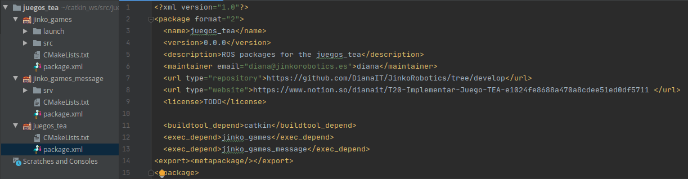
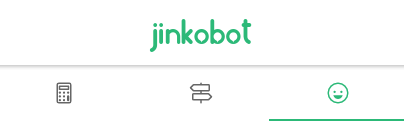

# T20 - Implementar Juego TEA


**COMANDOS EJECUCIÓN**

```bash
# EJECUTAR JUEGOS TEA
roscore
roslaunch jinko_games jinko_tea_games.launch

# Llamada al servicio /jinko_games_service desde consola
# [ triste, feliz, enfado, bici, coche, cine, piscina, bici ]
rosservice call /jinko_games_service "answer: 'triste'"

# APP
ionic serve
roslaunch rosbridge_server rosbridge_websocket.lauch
rosrun web_video_server web_video_server _port:=8080

# dirección http del streaming
http://localhost:8080/stream?topic=/camera_image&width:320&height=320
```

# TEMPLATE MATCHING

- [Explicación del proceso](https://www.notion.so/dianait/Feature-matching-with-FLANN-7802814c2a8e4902be60b1b83500878c)

# COMUNICACIÓN ROS-APP

### Mensaje SRV:  ***jinko_games_msg***

- Creación de un nuevo tipo de mensaje srv para la comunicación entre ROS y la app.

```bash
string answer
---
bool success
```

- Desde la app se enviará la respuesta *(**answer**)* al robot, dónde se tendrá que comprobar si es correcta y devolver true o false en consecuencia *(**succes**)*.

### Servicio: ***/jinko_games_service***

```bash
rospy.Service('/jinko_games_service', jinko_games_msg, checkAnswer)
```

### Metapackage *jinko_games*




- Se ha creado una clase TEAGame y un metodo check que devuelve si se ha producido coincidencia con un boleano

```bash
def checkAnswer(request):

    # Patron a buscar (triste, enfadado, coche, bici... )
    answer = request.answer

    # Ceamos objeto de la clase TEAGame
    game = TEAGame()

    # Generamos el mensaje respuesta del servicio
    response = jinko_games_messageResponse()
    response.success = game.check(answer)
    return response
```


# APLICACIÓN MOVIL

- Una vez se ha elegido un tipo de ejercicio



- Aparecerá un ejercicio y un botón con el icono de play

- Al pulsar el botón de play se llamará al servicio */jinko_games_service* con la función general creada para ello en el sprint anterior
  
    ```bash
    const nameService = '/jinko_games_service';
    const typeMessage = 'jinko_games_msg/jinko_games_msg';
    const data = { answer: this.answer };

    const callback = (result: any) => {
          // Si el resultado es TRUE se escribirá por consola BIEEEN si no OOOOHHH
    			this.response = (result.success) ? 'BIEEEEN' : 'OOOOOOHHH';
    			console.log(this.response);
    			};

    this.rosService.callService(nameService, typeMessage, data, callback);
    ```

- También se iniciará el semáforo que hará de temporizador para saber cuando se deberá levantar la tarjeta

# WEBCAM STREAMING

- Básicamente se trata de añadir un objeto CVBridge para hacer la conversión de la imagen de la webcam, que está en formato OpenCV a formato ROS para despues poder publicar mediante el método publish de rospy.Publsher

```bash
pub = rospy.Publisher('camera_image', Image, queue_size=100)
bridge = CvBridge()

# Dentro del while video.isOpened()
image_message = bridge.cv2_to_imgmsg(frame, 'bgr8')
pub.publish(image_message)
```


