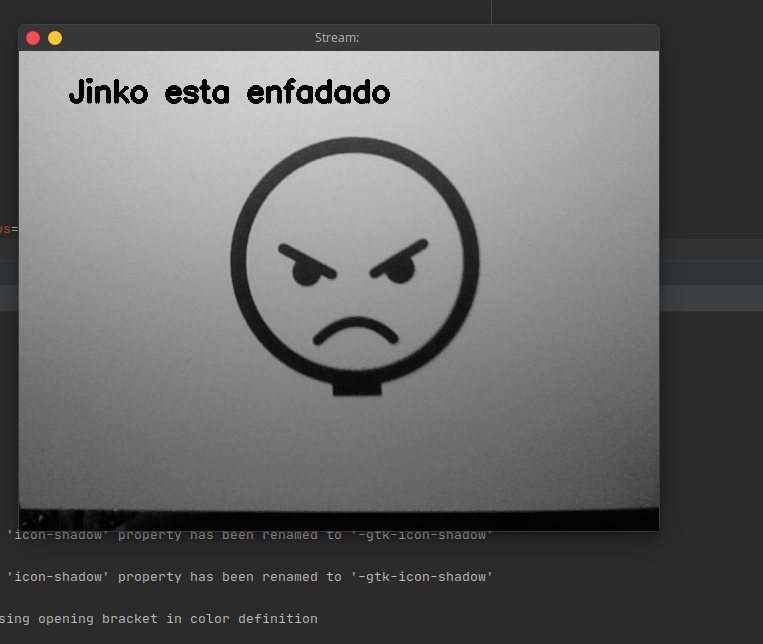
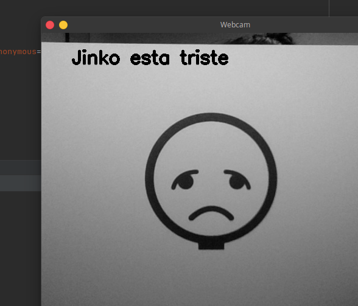
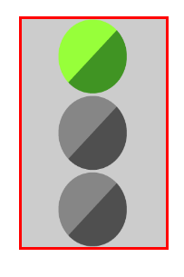

# T20 - Implementar Juego TEA


**COMANDOS EJECUCIÓN**

```bash
# EJECUTAR JUEGOS TEA
roscore
roslaunch juegos_tea jinko_tea_games.launch

# Llamada al servicio /jinko_games_service desde consola
rosservice call /jinko_games_service "answer: 'triste'"

# APP
ionic serve
roslaunch rosbridge_server rosbridge_websocket.lauch
```

# TEMPLATE MATCHING

- Se ha utilizado el método **MT_CCORR_NORMED** porque es el que mejores resultados a dado para la detección.
- Con un umbral sobre 0.85 funciona bastante bien

```bash
template = "triste"
# Umbral de detección
threshold = 0.85
position = np.where(res >= threshold)

for pt in zip(*position[::-1]):
	frame = cv2.putText(frame, 'Jinko esta ' + template, (50, 50),
											 cv2.FONT_HERSHEY_SIMPLEX, 1, (0, 0, 0), 2, cv2.LINE_AA)
     
```





# COMUNICACIÓN ROS-APP

### Mensaje SRV:  ***jinko_games_msg***

- Creación de un nuevo tipo de mensaje srv para la comunicación entre ROS y la app.

```bash
string answer
---
bool success
```

- Desde la app se enviará la respuesta *(**answer**)* al robot, dónde se tendrá que comprobar si es correcta y devolver true o false en consecuencia *(**succes**)*.

### Servicio: ***/jinko_games_service***

```bash
rospy.Service('/jinko_games_service', jinko_games_msg, checkAnswer)
```

### Metapackage *jinko_games*


- La detección de la coincidencia se hace a través de una variable que por defecto es False y que solo pasa a True si la variable position tiene valores en su interior, ya que estos valores son dónde han habido coincidencias


# APLICACIÓN MOVIL

- Una vez se ha elegido un tipo de ejercicio


- Aparecerá un ejercicio y un botón con el icono de play

- Al pulsar el botón de play se llamará al servicio */jinko_games_service* con la función general creada para ello en el sprint anterior
  
    ```bash
    const nameService = '/jinko_games_service';
    const typeMessage = 'jinko_games_msg/jinko_games_msg';
    const data = { answer: this.answer };

    const callback = (result: any) => {
          // Si el resultado es TRUE se escribirá por consola BIEEEN si no OOOOHHH
    			this.response = (result.success) ? 'BIEEEEN' : 'OOOOOOHHH';
    			console.log(this.response);
    			};

    this.rosService.callService(nameService, typeMessage, data, callback);
    ```

- También se iniciará el semáforo que hará de temporizador para saber cuando se deberá levantar la tarjeta



